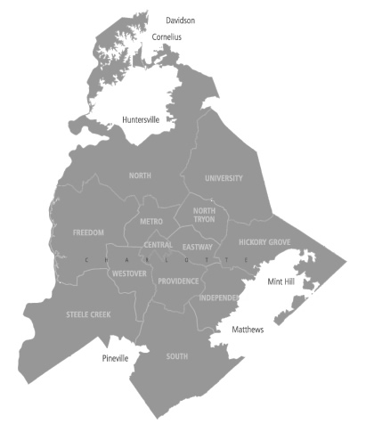
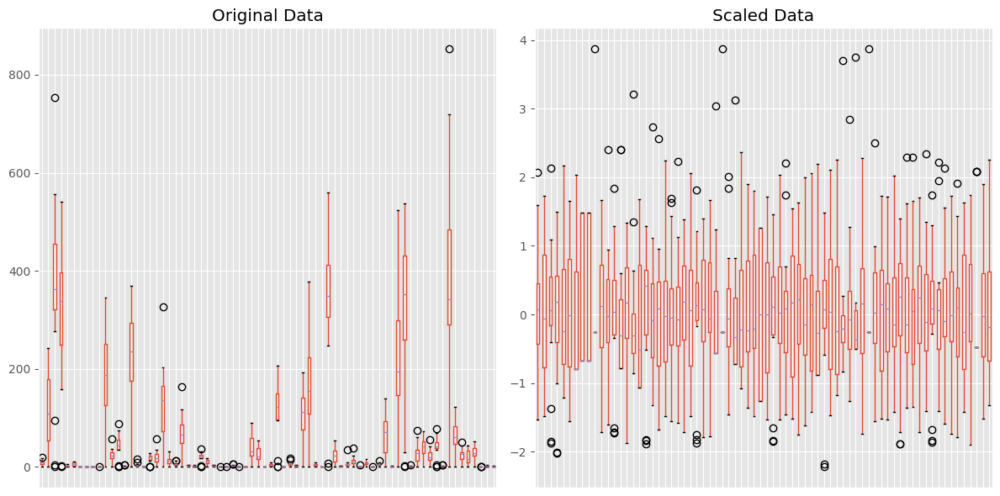
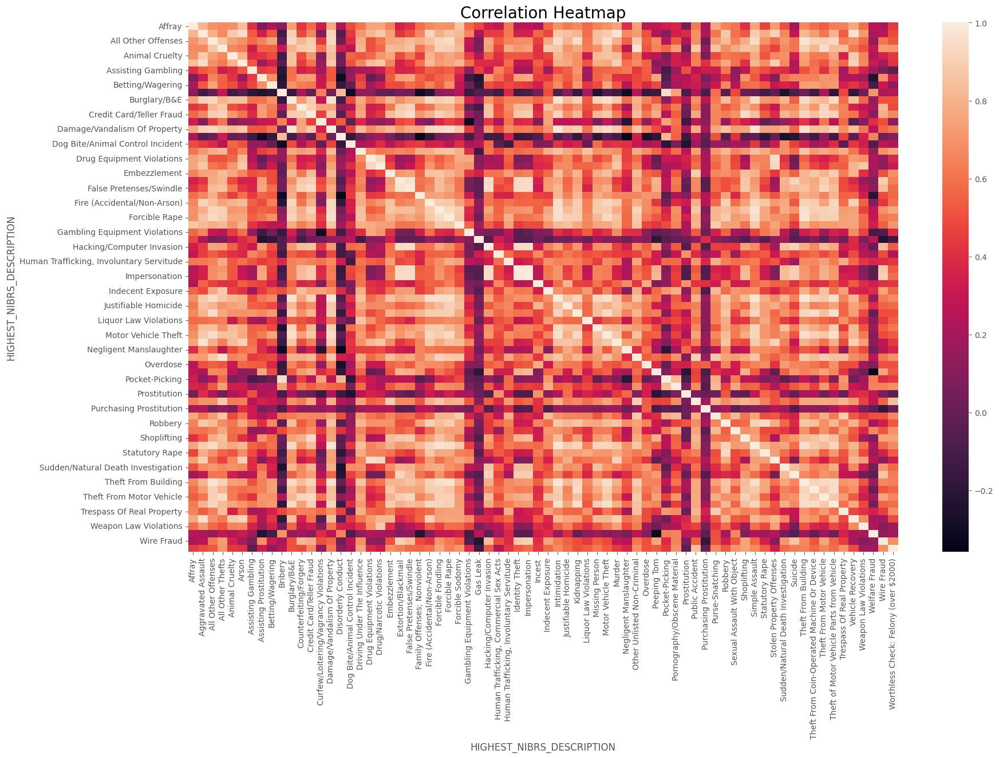
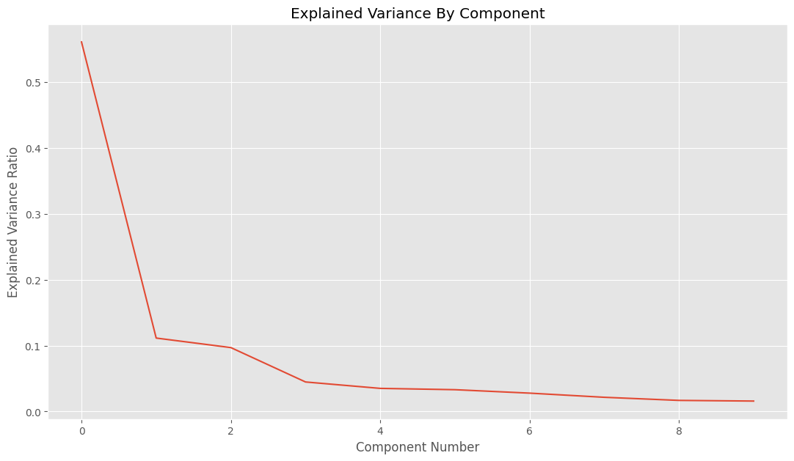
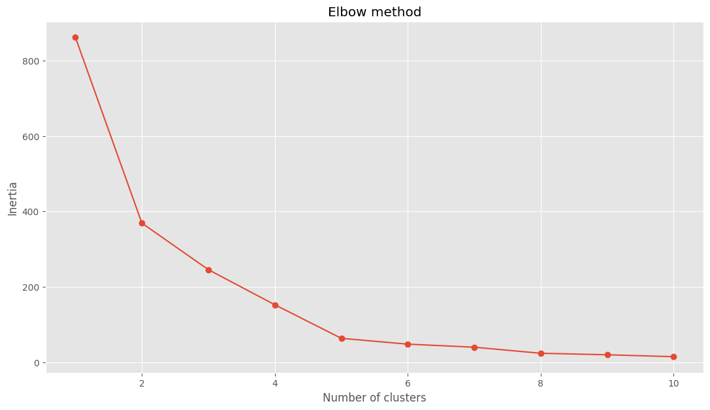
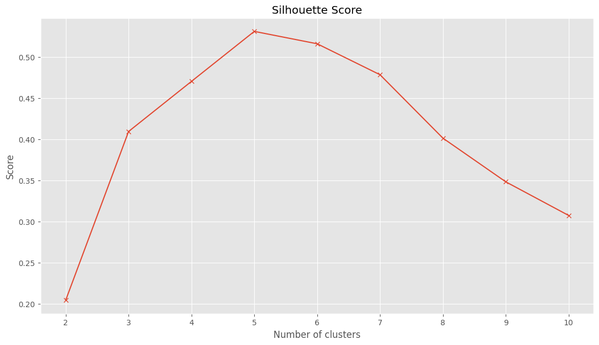
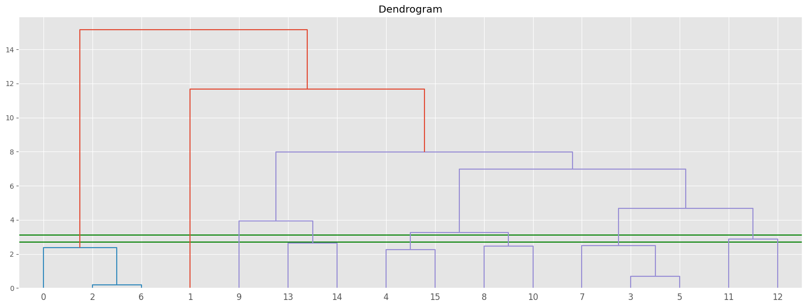

## **Charlotte's Neighborhood Crime Over Time Through Clustering**

### **Overview**
For Project 4, the goal is to work with clustering.  Writing is critical here, as the main goal will be to discuss your process, why you take certain steps, and tell a story around your data and insights gained through both modeling and visualizations. Thus, your writing should portray your critical thinking about the data, the process, and what knowledge you find.

##  **Introduction**
Crime is a concern for many urban areas in the United States, and Charlotte is no exception. It is important to understand crime patterns and statistics to help communities and law enforcement agencies develop plans, allocate resources, and engage with the community to improve public safety. The Charlotte-Mecklenburg Police Department (CMPD) regularly publishes detailed crime reports. As of July 22, 2024, overall crime in Charlotte has seen a slight increase of 1% compared to the previous year. This includes various types of crimes, categorized broadly into violent crimes and property crimes.
Previously, [Project 1 ](https://pmb-7684.github.io/Data_Mining_Project_1/) Charlotte's Neighborhood Crime Over Time explored the data through exploratory data analysis. It focused on how much crime changed over time based on the different neighborhoods or divisions. 

For this project, the data will be explored through clustering analysis. Again, the data explored how crime has evolved over time in different communities and how does location (such as open field, department store, hotel/motel, etc.) of the incident within neighborhoods effective crime. The difference is that clustering will be used to explore if certain neighborhood belongs to the same cluster and types of crimes are likely to happen in those clusters. 

By determining communities that are experiencing higher than normal levels of crime and specific location, the city, local law enforcement, and community can help allocated resources, develop plans and support community outreach to support all neighborhoods.

CMPD Data [Portal](https://data.charlottenc.gov/datasets/charlotte::cmpd-incidents-1/about)

City of Charlotte[ GIS](https://maps.mecknc.gov/openmapping/data.html)

The full jupyter notebook can be found [here.](https://colab.research.google.com/drive/1ZZhK84cg-rFe9xzMKBNEbsdBWii1uGIm?usp=sharing)



### **What is clustering and how does it work?**
In general, clustering is the process of grouping items with common characteristics into a group.

**K-means** is an unsupervised algorithm used for clustering. The algorithm works by dividing a group of observations into a predetermined number of clusters. This number of clusters (k) is determined by the user. The user can either randomly select a number or use a method such as "elbow method" to calculate the number of clusters. <br>

Once k is decided, k data points are randomly selected to be the centroids (centers of the clusters). Each observation is then assigned to the nearest centroid based on distance. After all observations are assigned, the centroids are recalculated by averaging the points assigned to each cluster. This process of determining distances and reassigning observations is repeated until the centroids no longer move, no data points change clusters, or the maximum number of iterations is reached. This iterative process ensures that the clusters are as compact and well-separated as possible. 

**Agglomerative Clustering** is another clustering algorithm.  It works by splitting and merging the closest pairs of clusters until all the observations belong to a single cluster.

### **The Dataset**

The dataset is available from the city of Charlotte's open data portal. It is available in various formats including CSV and contains both criminal and non-criminal incident reports from 2017 through 2024. At the time this file was downloaded, it contained 688,973 observations and 29 features.

#### Some Domain and Variable Notes:

•	`X`, `Y` are unknown decimal values.

•	`INCIDENT_REPORT_ID` is the case number associated with the incident.

•	`LOCATION` is the physical address of the incident.

•	`X_COORD_PUBLIC`, `Y_COORD_PUBLIC` are unknown integer values.

•	`CMPD_PATROL_DIVISION` is the name of the division. It corresponds to numeric 'DIVISION_ID'.

•	`ADDRESS_DESCRIPTION` is a higher-level description of where the incident took place. Field mainly contained 'Location of occurrence' or 'Location where officer took report'

•	`NPA` is the Neighborhood Profile Area ID, a unique number that is assigned to different neighborhoods in Charlotte. It replaced the previous method of using the name of the community.

•	`PLACE_TYPE_DESCRIPTION` is a detailed description of 'LOCATION_TYPE_DESCRIPTION' which indicates if private resident, Gas station, etc.

•	`CLEARANCE_DETAIL_STATUS` is detailed description of 'CLEARANCE_STATUS' which provides how a case was cleared.

•	`HIGHEST_NIBRS_CODE` is the highest offense id number for the incident as defined by the FBI's National Incident-Based Reporting System (NIBRS)

•	`OBJECTID` is the index.

•	`GlobalID` is an unknown alpha-numeric value.

The shape of the orginal dataset is (688973, 29).


### **Pre-Processing**

By thoroughly cleaning the data, we will improve the accuracy of our model and save time by removing errors in advance.  The same pre-processing was completed on this project as completed on project one. Since most of the pre-processing was completed for project 1, below is a summary of task completed.  The following features were not used in the modeling or analysis and removed.

##### **Irrelevant**

`X` and `X_COORD_PUBLIC` contained the same value. The only difference was `X` was in decimal format and  `X_COORD_PUBLIC` was in integer format.  This was the same situation for '`Y` and `Y_COORD_PUBLIC`. 

`INCIDENT_REPORT_ID` represents the unique report number associated with each incident. 

`GlobalID` is an alphanumeric variable. Its purpose could not be determined. 

`OBJECTID` seems to be an index for the dataset. 

`LOCATION` (physical address of the incident), `CITY`, `STATE`, and `ZIP` can be replaced by the DIVISION_ID OR CMPD_PATROL-DIVISION which are better suited in describing where the incident took place.

##### **Missing Values**

After checking for missing data, there were six columns that were missing values: STATE, ZIP, CMPD_PATROL-DIVISION, DATE_INCIDENT_END, ADDRESS_DESCRIPTION, and CLEARANCE DATE.  STATE and ZIP as stated above were not used and removed.

`CMPD_PATROL_DIVISION` is a more descriptive version of DIVISION_ID, so we can impute the missing information based on the current values in DIVISION_ID.  

`DATE_INCIDENT_END` indicates the date that the incident or cases were resolved.  I will impute those missing dates with today’s current date.  This will provide an accurate measure of the number of days that a case has been open, if I decide to create a column in the future.  For the same reason we will retain the CLEARANCE DATE and impute it with the current date.

`ADDRESS_DESCRIPTION` can also be replaced by the CMPD_PATROL-DIVISION.

`LOCATION_TYPE_DESCRIPTION` provides a high-level location for the incident. This will be replaced with a better feature.

##### **Data Types Checked**

All variables were of type `object`, except for YEAR, X_COORD_PUBLIC, Y_COORD_PUBLIC, LATITUDE_PUBLIC, LATITUDE_PUBLIC, and NPA.  Those data types are numeric.

##### **Index**

Normally, when data is imported, python automatically creates an index; however, the first row is index as 0 rather than 1. Now, the first row is indexed at 1 and the column is named ID. Since we are analyzing clusters, we do not need the ID feature.

The data set contains 14 features and 688,345 observations.

Now that we have a clean file, the data set needs to be transformed.  The cluster analysis will be based on the sixteen divisions and the type of crimes in those divisions.  So, the number of features will be considerably smaller. The following code was used to generate a pivot table.

`CLT_pivot = pd.pivot_table(CLT_group, values='Count',
                          index='CMPD_PATROL_DIVISION',
                          columns='HIGHEST_NIBRS_DESCRIPTION', aggfunc='sum', fill_value=0)`

<iframe src="table/CLT_pivot_table.html" style="width:100%; height:600px; border:none;"></iframe>

Next, we need to "normalize"  the data in a non-statistical way.  Below, there are a lot of variances between the data points.   To achieve this let's divide the total crime count by the number of years of crime data available. `CLT_pivot_normalized = CLT_pivot / years` Normalization is beneficial for clustering models like k-means.  This model uses distance between points and extreme values can dominate the results.  

Lastly, the data needs to be standardized. `CLT_standard_norm = pd.DataFrame(StandardScaler().fit_transform(CLT_pivot_normalized ),columns = CLT_pivot_normalized .columns)` This is a requirement for both k-means and agglomerative hierarchical clustering.  It transforms the data to having a mean of 0 and standard deviation of 1.

Finally, we have a dataframe with 72 features and 16 observations.

### **Data Understanding/Visualization**
When working with k-mean clustering it is important that all features are on the same scale. Recall with k-means algorithm it calculates the distance between points. If we failed to scale, then points with a higher value will skew the calculations and likely those calculated would be inaccurate.

Referring to the chart below, the x-labels were removed to reduce the amount of clutter on the axis since there are so many features. We can visually see the importance of standardization. Before standardization, our features ranged from 0 to over 1200. After standardization, all features are between -3 and 4. The standardized data will perform much better.



One method of visualizing relationships is through correlation heat map.   Crimes such as bribery, disorderly conduct, and hacking contain a lot of darker colors.  This indicates slightly negative association which means as one crime increase the other crime decreases.

**Talk more about relationships**


### **Modeling(Clustering)**
For this project, we experimented with k-means and agglomerative.  Both algorithms require the data to be standardized. Also, PCA is used to reduce the number of features in the data set while retaining the most important relationships.  Recall the goal is to determine if there are similarities between neighborhoods.  By using clustering we can see those groupings.

**k-means**

Pros
<ul type ="circle">
 <li>It is easier to use and understand in comparision to Agglomerative Hierarchical Clustering.</li>
 <li>It can handle large dataset with many features.</li>
</ul>

Cons
<ul type ="circle">
 <li>The user must specify the number of clusters in the beginning.</li>
 <li>It assumes spherical and equally sized clusters. So, not suitable for all datasets.</li>
</ul>  <br>

**Agglomerative Hierarchical Clustering**

Pros
<ul type ="circle">
 <li>It does not require that the user to specify the number of clusters in advance.</li>
 <li>It can handle non-spherical and different sized clusters.</li>
</ul>

Cons
<ul type ="circle">
 <li>It can be slower.</li>
 <li>It can be computational complex.</li>
</ul>

#### Principal Componenet Analysis (PCA)
PCA will be used for both models to reduce the number of features in the data set while retaining the most important relationships. It reduced to just 3 combinations of features.




#### **k-means**
The process for k-means begins with deciding on the number of clusters in the data. There are 16 districts (or neighborhoods) that are now labeled 0 - 15.

#### elbow method
Rather than guessing on the number of clusters, the elbow method was used. This method plots the variance based on the number of clusters. The bend in the elbow is selected as the optimal number of clusters. It represents where adding more clusters does not change the sum squared distance of each point to its centroid. Pick the k value, where the average distance falls. Based on the elbow chart below, there is a sudden fall in average distance at the best number of clusters is 2, 3, 4, and 5. The value of k can be subjective. 

Below, k-means was computed for k = 2,3,4,5,6,7,8,9 and 10.  The neighborhood by cluster and their average distance.  The average distance was computed using the following `  average_distances = np.mean(cluster_distances) .`  Recall, the best valu


Cluster 2
```
Average distances to cluster centers 0 : 1.048895108693887
Average distances to cluster centers  1 : 4.882079076503271
```
<iframe src="table/group2.html" style="width:100%; height:600px; border:none;"></iframe>

Cluster 3

```
Average distances to cluster centers  0 : 1.048895108693887
Average distances to cluster centers  1 : 3.797262823888206
Average distances to cluster centers  2 : 3.9403778182007745
```
<iframe src="table/group3.html" style="width:100%; height:600px; border:none;"></iframe>

Cluster 4

```
Average distances to cluster centers  0 : 1.048895108693887
Average distances to cluster centers  1 : 1.7914051320116562
Average distances to cluster centers  2 : 3.9403778182007745
Average distances to cluster centers  3 : 2.02173097587902
```
<iframe src="table/group4.html" style="width:100%; height:600px; border:none;"></iframe>

Cluster 5

```
Average distances to cluster centers  0 : 1.048895108693887
Average distances to cluster centers  1 : 1.7914051320116562
Average distances to cluster centers  2 : 2.412588434415901
Average distances to cluster centers  3 : 2.02173097587902
Average distances to cluster centers  4 : 0.0
```
<iframe src="table/group5.html" style="width:100%; height:600px; border:none;"></iframe>

Cluster 6

```
Average distances to cluster centers  0 : 1.048895108693887
Average distances to cluster centers  1 : 1.4682374763291322
Average distances to cluster centers  2 : 1.8362119818816374
Average distances to cluster centers  3 : 2.02173097587902
Average distances to cluster centers  4 : 0.0
Average distances to cluster centers  5 : 1.4339672723904813
```
<iframe src="table/group6.html" style="width:100%; height:600px; border:none;"></iframe>

Another method for determining the number of clusters is silhouette.  This method compute coefficients of each point and measures how much a point is like its own cluster compared to  other clusters.  The score ranges between 1 and -1 where a high represents that the point matches the cluster.  Based on visualization, five seems to be the optimal number of clusters.




Cluster 7

```
Average distances to cluster centers  0 : 1.048895108693887
Average distances to cluster centers  1 : 1.4682374763291322
Average distances to cluster centers  2 : 1.1335497740018676
Average distances to cluster centers  3 : 1.3122798082020588
Average distances to cluster centers  4 : 0.0
Average distances to cluster centers  5 : 1.4339672723904813
Average distances to cluster centers  6 : 1.5523602775977956
```
<iframe src="table/group7.html" style="width:100%; height:600px; border:none;"></iframe>

#### **Agglomerative Hierarchical Clustering**
The second method used for clustering and to determine the optimal number of clusters is Agglomerative Hierarchical Clustering.  After the visualization is  created,  horizonal lines are added to the plot.  First, we plot the highest vertical distance that does not intersect with any cluster that line is 3. Then count the number of vertical lines that cross that threshold.  For this method, 8 is the optimal number of clusters.



Cluster 8

```
Average distances to cluster centers  0 : 0.0
Average distances to cluster centers  1 : 1.1335497740018676
Average distances to cluster centers  2 : 1.3122798082020588
Average distances to cluster centers  3 : 0.0
Average distances to cluster centers  4 : 1.4682374763291322
Average distances to cluster centers  5 : 1.4339672723904813
Average distances to cluster centers  6 : 1.5523602775977956
Average distances to cluster centers  7 : 0.08850868075261464
```
<iframe src="table/group8.html" style="width:100%; height:600px; border:none;"></iframe>

### **Storytelling (Clustering Analysis)**
`Use this section to further analyze your clusters.  What information or insights does it tell you? What have you learned? Were you able to answer your initial problems/questions (if so, discuss that)?`<br>
Let's look at the k = 2, 3, 4, 5, and 6.

k = 2 is not an ideal choice.  The average distance for cluster 0 is okay; however, the average distance for cluster 1 is far from the centroid at 4.88. Cluster 1 is not optimal and should be split further.

k = 3 is not an ideal choice.  The average distance for cluster 0 remained the same and there was no change to the neighborhoods included. (Airport, Davidson, and Huntersville)  The other Cluster was split into 2 clusters; however, those average distances are still higher with 3.79 and 3.94 respectively. 

k = 4 is not an ideal choice.  Cluster 0 remained the same.  Cluster 1 is improving with an average distance of 1.79 (Freedom, Metro, North Tryon, Westover).  The other 2 clusters have higher average distances with 3.94 and 2.02.

k = 5 shows improvement but it is not an ideal choice.  Cluster 0 continues to remain unchanged. Also, cluster 1 remained unchanged.  Cluster 4 contains one neighborhood with distance of 0.  Cluster 2 and 3 continue to have an opportunity for improvement with 2.41 and 2.02 respectively.

k = 6 again with see improvements within the clusters. Clusters 0, 1,and 4 remain unchanged. Cluster 2 is 1.83. Cluster 3 is 2.02 and cluster 5 is 1.43.  This is the optimal value based on the elbow method

Before looking at k = 8 for Agglomerate hierarchical clustering, let's check out the results for k=7.

k = 7 now all clusters with an average distance less than 2.  Cluster 0, 1, and 4 continue to remain unchanged.

k = 8 for agglomerate hierarchical clustering continues to have all average distances under 2.  However, cluster 0 which contained airport, Davidson, and Huntersville from k =2,3,4,and 5, now only contains the Airport.  Davidson, and Huntersville are together in cluster 7.  Since Davidson, and Huntersville are in the same area of Mecklenburg County it makes sense for them to be clustered together.  It is also understandable to have the Airport in a cluster by itself.  Now, Central and Airport are clustered by themselves.


For this experiment, k= 7 or 8 are the optimal values.  I think k= 7 is better since it only has one neighborhood in a cluster by itself.  As the number of clusters increases, there is a point where there are too many clusters.  Also, the average distance for all clusters is below 2.
The one thing that surprised me with `Central` division and the fact that it's by itself in a cluster.  I would have thought it would fall into Eastway. It indicates how much that area has changed over the years.


### **Impact Section**
From the analysis we were able to see that some neighborhoods have similar types of crime.  This can be beneficial if a proposal or recommendation works for one area within a cluster, it might be a good suggestion to try the same recommendation on a neighborhood in that cluster.  Using this approach the city could save money by relying on methods that work rather than spending on studies to research a problem.

When technology is used in crime prevention, it can be both positive and negative. The positive impact is that law enforcement could meet with city officials to discuss ways to reduce crime by increasing lighting in areas, increased police patrols in certain or talking with community groups who are able to go into the neighborhoods (along with law enforcement) to make a positive impact. In addition,by clustering neighborhoods, if we find a solution that works within one neighborhood in a cluster, it might be appropiate to try it in a similar neighborhood.

On the negative side, law enforcement could decide to increase patrols in certain areas to the point that everyone in the community feels as if they were under surveillance. It's possible that crime could be reduced, because the criminals are leaving one area and moving to another area.

### **References**
1. References from project 1 - Data Exploration
4. CompletedCluseringDemo.ipynb
5. https://www.statology.org/k-means-clustering-in-python/
6. https://towardsdatascience.com/machine-learning-algorithms-part-12-hierarchical-agglomerative-clustering-example-in-python-1e18e0075019
7. https://towardsdatascience.com/silhouette-method-better-than-elbow-method-to-find-optimal-clusters-378d62ff6891
